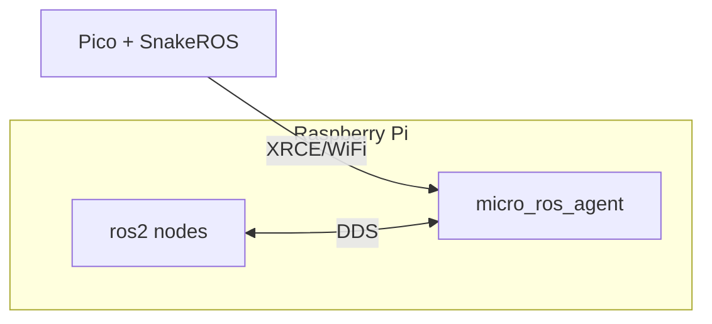
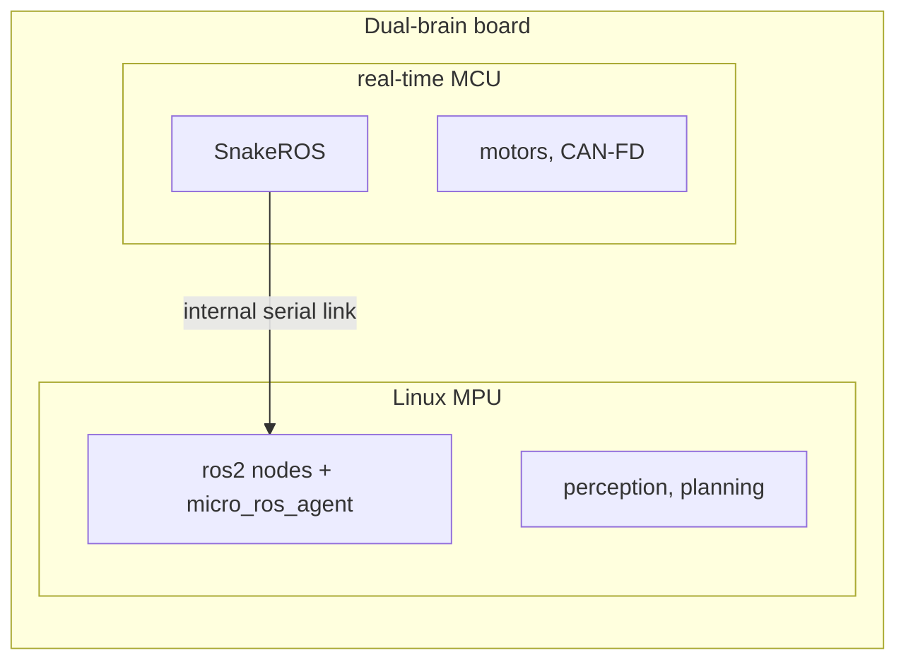

# Architecture

## The insight this rests on

**The micro-ROS Agent is a standard DDS-XRCE agent.** It does not care whether
the client on the other end of the wire is C, Rust or Python — only that the
bytes are right. So SnakeROS ships *no host-side software at all*: no bridge,
no relay node, nothing to install beside your ROS 2 system.

```mermaid
flowchart LR
    board["MicroPython board<br/>+ snakeros"] -->|XRCE<br/>UDP / serial| agent["micro-ROS Agent<br/>(stock, unmod'd)"]
    agent -->|DDS| graph["ROS 2 graph"]
```

## Why a pure-Python client is even possible

XRCE creates its entities from **XML strings sent at runtime**:

```xml
<dds><topic><name>rt/chatter</name>
<dataType>std_msgs::msg::dds_::String_</dataType></topic></dds>
```

Participant → topic → publisher → datawriter, all as strings. That is the
whole trick. Supporting a new ROS 2 message type is *string concatenation*,
not code generation — which is why adding a type never means rebuilding
firmware.

Every previous attempt at MicroPython + ROS 2 went the C-bindings route, and
every one is now archived. Bindings mean custom firmware per board, a
CMake/colcon toolchain, and "new message type = write C and reflash". That
friction is what killed them.

## The layers

```
snakeros/
├── node.py            Node, Publisher, Subscription, Timer
├── services.py        service client and server
├── parameters.py      ros2 param support
├── board.py           WiFi, resilient reconnection, heap tools
├── msg/               message type system and generated packs
│   └── _base.py       schema, struct fast path
├── cdr/               XCDR1 encode and decode
│   ├── writer.py
│   └── reader.py
├── xrce/              the DDS-XRCE protocol
│   ├── const.py       constants taken from eProsima's C sources
│   ├── entities.py    object ids, name mangling, entity XML
│   ├── session.py     handshake, entity lifecycle, data
│   └── reliable.py    HEARTBEAT/ACKNACK, retransmit window
└── transport/
    ├── udp.py
    ├── serial.py
    └── framing.py     HDLC framing and CRC-16
```

Each layer depends only on the one below, and the transport contract is four
methods (`open`/`send`/`recv`/`close`) so a different transport — or a
different middleware entirely, should Zenoh become the right answer — slots in
underneath without disturbing anything above.

## Two alignment rules, and why they differ

This is the subtlety that would silently corrupt every `float64` if you got it
wrong.

**XRCE framing is datagram-relative.** Submessage headers align to 4 bytes
measured from the start of the datagram.

**The ROS message payload restarts at zero.** micro-ROS hands the message
serialiser a *fresh* CDR buffer:

```c
ucdr_init_buffer(ub, ub->iterator, (size_t)(ub->final - ub->iterator));
```

so a message's own alignment is relative to its own first byte, wherever in
the datagram it lands. Had this been datagram-relative, every `float64` in
every message would sit at the wrong offset — and decode *cleanly* as the
wrong number, which is the worst possible failure mode.

## What the Agent does that we do not

- **Discovery and the ROS graph.** The Agent owns it. SnakeROS has no graph
  API and does not need one.
- **The CDR encapsulation header.** There is none on the wire; the Agent adds
  it when forwarding to DDS.
- **DDS QoS negotiation.** We declare QoS in the entity XML; the Agent
  negotiates.

## Why not DDS directly?

The most common question about this design. Four reasons, and the first is
decisive.

### 1. Discovery would not fit in the memory

DDS discovery (SPDP/SEDP) requires **every participant to hold a complete
picture of the graph** — every remote participant, every endpoint, its QoS and
its type. That state grows with the size of your robot, and from a single
node's point of view it is unbounded: you cannot cap it without breaking
discovery.

A Pico W has roughly 190 KB of usable heap. SnakeROS currently leaves 113 KB of
that free with every message pack imported (see [memory](memory.md)). The
discovery state for a moderate ROS 2 graph would consume that with no way to
bound it.

XRCE moves the graph to the Agent. The client holds a handful of **2-byte
entity IDs** and nothing else.

### 2. Multicast

SPDP depends on multicast, and consumer WiFi handles multicast badly — commonly
rate-limited to the slowest basic rate, or dropped entirely while a client is
in power-save. This is bad enough that full ROS 2 deployments frequently move
to Discovery Server or Zenoh when WiFi is involved. Microcontroller IP stacks
are usually worse.

XRCE is plain unicast to a known address.

### 3. Protocol surface

Full RTPS means writer and reader proxies, history caches, heartbeats,
acknacks, gaps, fragmentation, and the whole QoS matrix — durability, deadline,
liveliness, lifespan, ownership, partitions.

SnakeROS implements heartbeat/acknack and fragmentation for XRCE's *much*
smaller reliable-stream model, and that alone is a substantial piece of
`snakeros/xrce/reliable.py`. RTPS is a different order of work — and all of it
would be pure Python on a 133 MHz Cortex-M0+.

### 4. It is the standard built for exactly this

DDS-XRCE is an OMG specification titled *DDS for eXtremely Resource Constrained
Environments*. micro-ROS is built on it, and so is PX4's `uXRCE-DDS` bridge.
Speaking it is how a constrained device is *supposed* to join a DDS system.

### And one reason specific to SnakeROS

XRCE's XML entity strings are what make a pure-Python client possible at all:

```xml
<dds><topic><name>rt/chatter</name>
<dataType>std_msgs::msg::dds_::String_</dataType></topic></dds>
```

That is string concatenation. DDS discovery carries **type information on the
wire**, which drags you back toward on-device type support and code
generation — the friction that killed every previous attempt at MicroPython and
ROS 2 (see [Why a pure-Python client is even possible](#why-a-pure-python-client-is-even-possible)).

### The honest counterpoint

**It is not impossible.** [mros2](https://github.com/mROS-base/mros2)
implements RTPS on embedded targets. But it is C++ on a Cortex-M with an RTOS
and lwIP. That is a different proposition from pure Python on a Pico, and it
does not remove the memory argument — it manages it with a compiled language
and a bigger chip.

**Zenoh does not remove the intermediary either.**
[`rmw_zenoh`](https://github.com/ros2/rmw_zenoh) is released for Jazzy and
Kilted, and [zenoh-pico](https://github.com/eclipse-zenoh/zenoh-pico) supports
the Pico. But zenoh-pico runs in *client* mode against a **router** —
architecturally the same shape as an Agent, just a different process to run. It
is a serious candidate for the future, not an escape from having something in
the middle.

That is why the transport contract is only four methods
(`open`/`send`/`recv`/`close`): if Zenoh becomes the right answer, it slots in
underneath without disturbing anything above it.

## Where the Agent runs

**The Agent is a process, not a machine.** This trips people up: it does not
need its own hardware, and it is not a bridge you have to write or maintain. It
is stock `micro_ros_agent`, and it normally runs on the computer that is
already running your ROS 2 nodes.

### A Raspberry Pi, or any Linux ROS 2 machine



No extra hardware, no extra network hop, and nothing of SnakeROS's on the Pi.
Your board's topics appear in `ros2 topic list` like any other node's.

### Dual-brain boards

Boards that pair a Linux processor with a real-time MCU — the
[Arduino UNO Q](https://docs.arduino.cc/hardware/uno-q/) (Dragonwing QRB2210 +
STM32U585) and
[VENTUNO Q](https://blog.arduino.cc/2026/03/09/introducing-arduino-ventuno-q-your-new-ai-robotics-and-actuation-platform/)
(Dragonwing IQ8 + STM32H5) — are an interesting case, because both halves live
in one box:



**Do not use SnakeROS on the Linux half.** It is a full computer — run `rclpy`
there. SnakeROS earns its place on the MCU, which is where motor control and
hard timing belong anyway, with the Agent on the Linux half of the same board
and the [serial transport](transports.md) over the internal link rather than
WiFi.

That is a *plausible* architecture, **not one that has been tested**. The stock
development path for those MCUs is Arduino sketches rather than MicroPython, so
it would need a MicroPython board port for the specific chip (the STM32 port
supports both the U5 and H5 families) and the inter-brain link wired up to the
serial transport. Real work, not a download.

### One thing worth being clear about

ROS 2 has **no server**. It is a peer-to-peer graph in which nodes discover one
another and then talk directly. So "connecting SnakeROS to a ROS 2 system" is
not a matter of finding a server to log into — it is a matter of getting your
board represented in that graph, which is precisely the job the Agent does on
its behalf.

## Protocol notes

Findings that cost real debugging time are written up in
[`NOTES-protocol.md`](https://github.com/kevinmcaleer/snakeros/blob/main/NOTES-protocol.md)
— including the handshake header masking the session id, the missing
encapsulation header, and the CRC polynomial that eProsima's own docs get
wrong.
